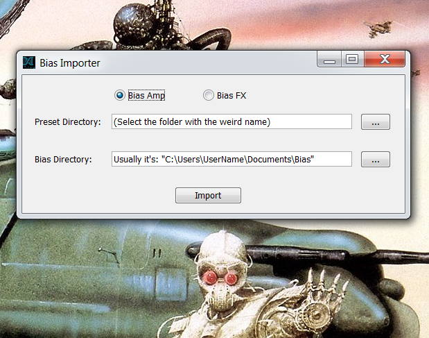

# Bias Preset Importer

## _A Java application that allows you to import Presets to Bias FX and Bias Amp offline_.

Now you can privately send presets to your friends without using the ToneCloud! (Requires a Java Runtime Enviroment)

## Why I made this
I made this app since Positive Grid hasn't released an offline Import Presets function yet, and many of my customers are having issues with the installation process of my custom Amps and Bias FX patches. Trying to troubleshoot these problems that come up with my clients over e-mail, is not fun at all.    

>I don't work for Positive Grid btw

## Take this app for a Test Drive

>Backup your presets before using the app

Try using the TestFiles/ for a testdrive.

.

After Importing your presets: 
- open up Bias FX and look in the "Factory Rock" bank.
- open up Bias Amp and look in the "Custom" bank.

------------
# [Youtube Tutorial](https://www.youtube.com/watch?v=kRq9uLDhsAA)

# [Get the .exe here](https://jimmypickboy.wordpress.com/2016/12/27/bias-preset-importer-application-for-windows/)
